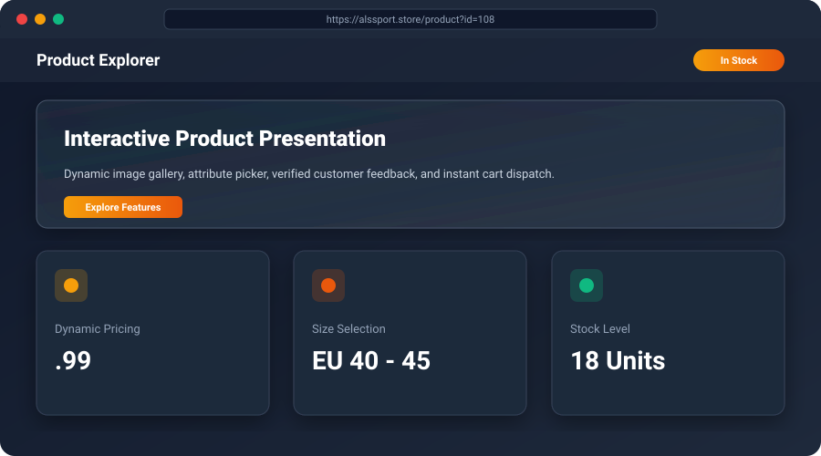
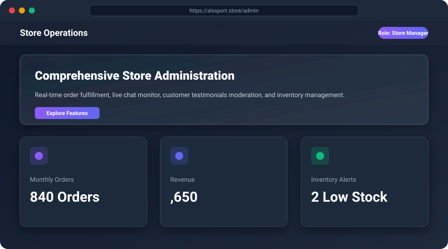



⚽ ALSSPORT - Sports Store E-Commerce Web Application
A robust, responsive e-commerce web platform for sporting goods and athletic apparel, featuring product catalogs, cart management, customer testimonials, live support chat, and a full administrative dashboard.

🌐 Live Demo & Quick Access
Storefront / Catalog: http://localhost/ALSSPORT/home.php
Shopping Cart & Checkout: http://localhost/ALSSPORT/order.php
Store Administration: http://localhost/ALSSPORT/admin.php
Demo Evaluation Credentials:
Store Administrator: Email: admin@alssport.com | Password: admin123
Customer Demo: Email: customer@example.com | Password: password123
📸 System Showcase & Screenshots
🛒 Storefront & Catalog👟 Product Detail & Options

💳 Checkout & Cart Flow📊 Store Administration Center

⚡ Core Technical Features
Dynamic Product Catalog & Filtering: Browse athletic shoes, apparel, and accessories with instant categorization, price range sorting, and brand discovery.
Asynchronous RESTful Endpoints (/api/): Decoupled backend handlers for live chat (api_chat.php), newsletter subscriptions (newsletter.php), testimonials (testimonials.php), and wishlist management (wishlist.php).
Cart & Order Processing Wizard: End-to-end purchasing workflow tracking customer information, applied discounts, order itemization, and mock payment verification.
Interactive Customer Engagement: Integrated live chat messaging mechanism allowing direct interaction between store operators and shoppers.
Store Operations Management: Comprehensive administrative control panel to manage catalog inventory, audit user orders, oversee customer reviews, and monitor traffic metrics.
Fully Responsive Mobile Experience: Hand-crafted CSS grid and flexbox layout ensuring seamless navigation on smartphones, tablets, and desktop workstations.
🛠️ Tech Stack
DomainTechnology / Specification
Backend LanguagePHP 8.0+ (Modular, OOP Helpers, REST JSON Endpoints)
DatabaseMySQL / MariaDB (Prepared Statements, Relational Schema)
API ArchitectureRESTful JSON endpoints with Fetch API / AJAX integration
FrontendHTML5, Modern Responsive CSS3, Vanilla JavaScript (ES6+)
Security LayerInput Sanitization, Session-Based Role Authentication, Rate Limiting
Web ServerApache (mod_rewrite, .htaccess security headers)
🏛️ System Architecture
ALSSPORT utilizes a Modular Front-Controller with Embedded REST APIs:
code
Text
HTTP Request (Browser / Client App)
       │
       ▼
 [ Entry Points / Routers ]
 (index.php, home.php, order.php, admin.php)
       │
       ├─────────────────────────────────┐
       ▼                                 ▼
[ REST API Handlers ]             [ Page Controllers ]
(/api/testimonials.php,           (home.php, admin.php,
 /api/wishlist.php, etc.)          order.php, verify.php)
       │                                 │
       ├─────────────────────────────────┘
       ▼
[ Security & Helper Layer ]
(security-helpers.php, auth.php, Session Management)
       │
       ▼
[ Database Access Layer ]
(db.php, config.php using PDO / MySQLi Prepared Queries)
       │
       ▼
[ Normalized MySQL Database ] (`alssport.sql`)
📂 Project Structure
code
Text
ALSSPORT/
├── api/                         # Asynchronous RESTful JSON endpoints
│   ├── newsletter.php           # Newsletter subscription processor
│   ├── reviews.php              # Product review submissions & ratings
│   ├── testimonials.php         # Customer testimonial feed
│   ├── track-view.php           # Analytics & product view counter
│   └── wishlist.php             # Wishlist add/remove operations
├── database/
│   └── alssport.sql             # Sanitized schema with demo catalog & users
├── docs/
│   └── screenshots/             # Interface mockups & feature screenshots
├── logs/                        # Application audit trail
│   └── order.php                # Order transaction log
├── uploads/                     # Product catalog and promotional imagery
├── .env.example                 # Environment configuration template
├── .gitignore                   # Production-grade git exclusion rules
├── admin.php                    # Store management dashboard
├── admin_chat.php               # Live support chat administrative console
├── api_chat.php                 # Real-time message polling endpoint
├── config.php                   # Core database & environment parameters
├── db.php                       # Database connection wrapper
├── home.php                     # Storefront catalog & hero showcase
├── order.php                    # Cart review & checkout wizard
├── submit_order.php             # Order persistence & invoice creation
└── verify.php                   # Mock payment verification gateway
🚀 Installation & Local Setup
1. Prerequisites
PHP: Version 8.0 or higher.
Web Server: Apache (e.g., XAMPP, WAMP, or standalone Apache).
Database Server: MySQL 5.7+ or MariaDB 10.3+.
2. Clone the Repository
code
Bash
git clone https://github.com/hzn806512-source/ALSSPORT.git
cd ALSSPORT
3. Database Setup
Open phpMyAdmin in your browser.
Create a new database named alssport:
code
SQL
CREATE DATABASE alssport CHARACTER SET utf8mb4 COLLATE utf8mb4_unicode_ci;
Import the sanitized schema:
Click on the alssport database.
Go to the Import tab.
Choose database/alssport.sql and click Import.
4. Configuration
Inspect config.php and db.php to ensure credentials match your local MySQL configuration:
code
PHP
$db_host = 'localhost';
$db_name = 'alssport';
$db_user = 'root';
$db_pass = '';
5. Launch the Application
Place the directory in C:/xampp/htdocs/ALSSPORT.
Open your browser and navigate to:
code
Text
http://localhost/ALSSPORT/home.php
🔒 Security & Privacy Sanitization Notes
Data Privacy Audit: The public database dump database/alssport.sql has been scrubbed of real-world personal information, customer contact numbers, and live host references. All demo accounts use anonymized credentials.
Environment Isolation: Credentials and sensitive files are excluded from version tracking through .gitignore.
Prepared Statements: Dynamic database inputs are sanitized against SQL injection vulnerabilities.
📄 License
This project is open-source under the MIT License.